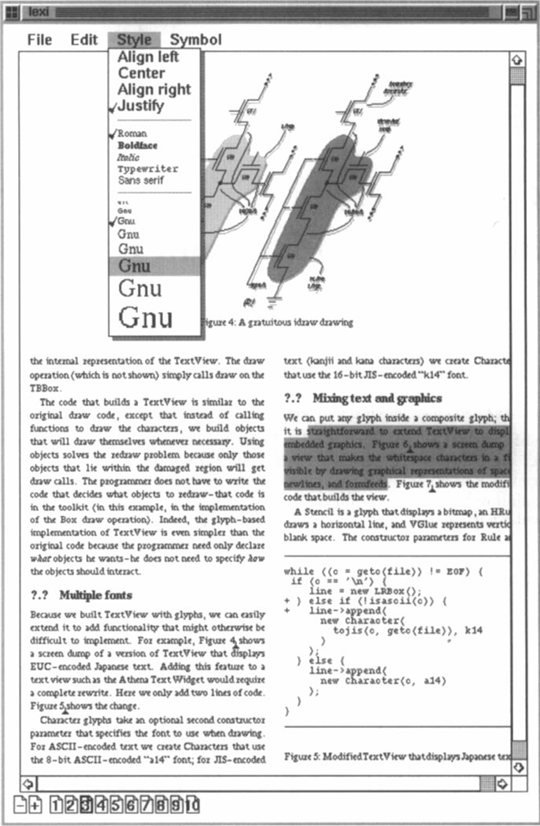

# Lexi

A "What-You-See-Is-What-You-Get" document editor called **Lexi**. We'll see how design patterns capture solutions to design problems in Lexi and applications like it.  

## Table of Contents

1. [Glyphs](./Glyphs.md)
2. [Composition](./Composition.md)
3. [UI](./UI.md)
4. [Look and Feel](./Look-and-Feel.md)
5. [Multiple Window](./Multiple-Window.md)
6. [User Operation](./User-Operation.md)

## 1. Design Problems

We will examine seven problems in Lexi's design:

1. Document structure. The choice of internal representation for the document affects nearly every aspect of Lexi's design. All editing, formatting, displaying, and textual analysis will require traversing the representation. The way we organize this information will impact the design of the rest of the application. 文档结构。文档的内部表示的选择影响Lexi设计的几乎每个方面。所有编辑、格式化、显示和文本分析都需要遍历表示。我们组织这些信息的方式将影响应用程序其余部分的设计。

2. Formatting. How does Lexi actually arrange text and graphics into lines and columns? What objects are responsible for carrying out different formatting policies? How do these policies interact with the document's internal representation? 格式化。Lexi如何将文本和图形排列成行和列？哪些对象负责执行不同的格式化策略？这些策略如何与文档的内部表示交互？

3. Embellishing the user interface. Lexi's user interface includes scroll bars, borders, and drop shadows that embellish the WYSIWYG document interface. Such embellishments are likely to change as Lexi's user interface evolves. Hence it's important to be able to add and remove embellishments easily without affecting the rest of the application. 集成用户界面。Lexi的用户界面包括滚动条、边框和阴影，这些都装饰了WYSIWYG文档界面。随着Lexi的用户界面的发展，这种装饰可能会发生变化。因此，能够轻松地添加和删除装饰而不影响应用程序的其余部分是很重要的。

4. Supporting multiple look-and-feel standards. Lexi should adapt easily to different look-and-feel standards such as Motif and Presentation Manager (PM) without major modification. 支持多种外观和感觉标准。Lexi应该能够轻松适应不同的外观和感觉标准，例如Motif和Presentation Manager（PM），而无需进行重大修改。

5. Supporting multiple window systems. Different look-and-feel standards are usually implemented on different window systems. Lexi's design should be as independent of the window system as possible. 支持多种窗口系统。不同的外观和感觉标准通常在不同的窗口系统上实现。Lexi的设计应该尽可能独立于窗口系统。

6. User operations. Users control Lexi through various user interfaces, including buttons and pull-down menus. The functionality behind these interfaces is scattered throughout the objects in the application. The challenge here is to provide a uniform mechanism both for accessing this scattered functionality and for undoing its effects. 用户操作。用户通过各种用户界面控制Lexi，包括按钮和下拉菜单。实现这些界面的功能分散在应用程序中的各个对象中。这里的挑战是提供一种统一的机制来访问这种分散的功能，并撤消其影响。

7. Spelling checking and hyphenation. How does Lexi support analytical operations such as checking for misspelled words and determining hyphenation points? How can we minimize the number of classes we have to modify to add a new analytical operation? 拼写检查和连字符。Lexi如何支持分析操作，例如检查拼写错误的单词和确定连字符？我们如何最小化添加新分析操作所需修改的类的数量？

We discuss these design problems in the sections that follow. Each problem has an associated set of goals plus constraints on how we achieve those goals. We explain the goals and constraints in detail before proposing a specific solution. The problem and 
its solution will illustrate one or more design patterns. The discussion for each problem will culminate in a brief introduction to the relevant patterns.

我们在下面的章节中讨论这些设计问题。每个问题都有一组相关的目标，以及实现这些目标的约束条件。我们详细解释目标和约束条件，然后提出具体的解决方案。问题及其解决方案将说明一个或多个设计模式。每个问题的讨论将以对相关模式的简要介绍结束。

## References
> *Design Patterns: Elements of Reusable Object-Oriented Software* / Erich Gamma ... [et al.].p. cm.—(Addison-Wesley Professional Computing Series) ISBN 0-201-63361-2 1. Object-oriented programming (Computer science) 2. Computer software—Reusability.  
> I. Gamma, Erich. II. Series. QA76.64.D47 1994005.1'2-dc20 94-34264 CIP  : Copyright © 1995 by Addison-Wesley.  

## Personal Project
> - This is a personal project to learn about design patterns and how they can be applied to real-world applications.

- I will re-implement the Lexi document editor using modern front-end technologies.